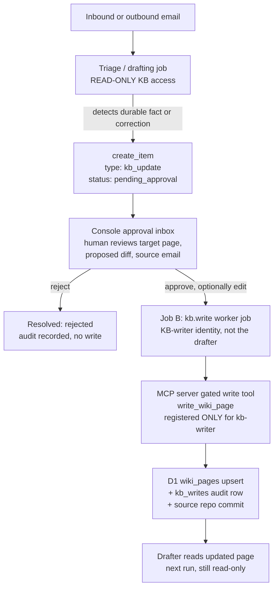

# Design: knowledge base write-back (human-gated)

Status: implemented (GH-110 server side in sealevel-mcp-server PR #26; GH-111/GH-112/GH-113 client side in this repo). Repo-commit durability (open question 1) remains open: the server's D1 write is immediately visible to the drafter but is rebuilt from the sealevel-knowledge-base repo by the wiki-sync Action, so an approved change is not durable across syncs until the repo-commit follow-up ships; the append-only `kb_writes` audit does survive syncs and preserves every change for replay.

Implementation notes vs. this design:
- The detector runs as a post-draft best-effort chain from the drafting job's recordUsage hook (detect -> search -> target -> read base -> compose, all on the triage model tier, forced tool calls); its usage folds into the source item's cost record. Gated on ANTHROPIC_API_KEY + the KB read connection; the eval harness never invokes the hook, so eval cases stay hermetic.
- The write tool's actual contract (PR #26) is `{name, content, base_hash, provenance {approved_by, source_ref, reason}}`; a stale base returns a structured conflict with `current_hash`. The item then records `kb_write: {status: "stale"}` and the honest recovery is a fresh proposal against the current page (reopen + re-approve would re-send the same stale base, so the console copy says so). `denied` (schedule/pricing denylist, identity) is likewise terminal per proposal; `failed` retries via BullMQ and then reopen + re-approve; without SEALEVEL_MCP_KB_WRITER_TOKEN the job records `skipped`.
- The console surface is the Knowledge inbox (/items/knowledge): pending proposals (also present in Pending) above the decided write history with provenance, diffs, and the Propose revert affordance. Rollback files a new kb_update whose base is the committed content and whose proposal is the stored prior content; it flows through the same approve-then-write gate.
- The write tool is idempotent server-side (identical content reports success without a duplicate audit row), which together with the deterministic kbwrite-<itemId> jobId is the no-double-commit guarantee; the client keeps no claim state.

Related: GH-57 (read-only KB wiring), sealevel-mcp-server GH-15 (visibility tiers), GH-16 (live schedule tool)

## Problem statement

Durable studio knowledge keeps arriving by email: a policy clarification Pete writes to a customer, a corrected price, a parking detail, a fact about the intro offer that is wrong on the wiki. Today that knowledge dies in the thread. The drafting job reads the knowledge base (search_wiki, read_wiki_page via the sealevel-mcp-server) but has no way to improve it, so the same gap or error keeps resurfacing in future drafts until someone remembers to edit the wiki by hand.

At the same time, the autonomous drafter must never gain write access. It runs unattended against untrusted input (inbound customer email), and a prompt-injected or simply mistaken model writing to the KB would silently corrupt the source the next hundred drafts are built on. The current architecture enforces this server-side: the drafter's service identity (`service:ai-manager`) only ever has the wiki read tools, `upcoming_classes`, and `ping` registered for its sessions (see `isServiceIdentity` gating in sealevel-mcp-server `src/index.ts`).

This design adds a separate, human-gated write path that closes the loop without weakening that boundary: the AI proposes, a human approves in the console, and only then does a gated write commit to the KB, with full provenance.

## Goals

- Capture durable facts and corrections surfaced in email traffic as proposed KB updates.
- Keep the autonomous drafter strictly read-only, with the same server-side defense in depth it has today.
- Human approval for every write, using the existing approval item pattern (same audit shape as email decisions: who, when, edited).
- Full provenance on every committed write (approver, source email, prior content, timestamp) and a human-gated rollback path.
- Consistent with the locked decisions: AI suggests, human confirms; nothing acts autonomously.

## Non-goals

- No autonomous KB writes, ever, in any phase of this design.
- No writes to the live class schedule. The schedule comes live from Mindbody via `upcoming_classes` and must stay single-sourced (see Guardrails).
- No general wiki editor in the console. The console approves or rejects specific proposed diffs; freeform wiki authoring stays in the sealevel-knowledge-base repo.
- No write access for the existing drafter service identity, and no expansion of what that identity can see.
- No changes to document, analytics, or Mindbody tools.

## Flow overview



Four stages, each with a hard boundary between them:

1. **Detect.** During triage of an inbound email (and, later, on approved outbound replies), a small classification call flags content that looks like a durable studio fact or a correction to an existing KB page. This mirrors the existing triage calls (`classifyEmailTags`, `suggestAssignee` in `packages/core/src/jobs/emailDraft.ts`): a separate, best-effort call whose result rides on the item structurally, never through the drafting prompt.
2. **Propose.** When the detector fires, the job creates an `items` row with `type: "kb_update"` and `status: "pending_approval"`. The payload carries the target page, the proposed change as a diff against the current page content, the source email reference, and a rationale. Creating this item is inert: it writes nothing to the KB.
3. **Approve.** A human reviews the proposal in the console approval inbox, alongside email replies. They can approve, edit then approve, or reject. The decision is recorded with the same audit shape as email decisions (`DecisionRecord`: action, by {id, name}, at, edited) via the same guarded single-UPDATE pattern in `decideItem`, so races and double-decisions are impossible.
4. **Write.** Approval enqueues a Job B (the same durable two-event state machine used for email send on approval): a worker job that calls a new gated `write_wiki_page` tool on the MCP server, authenticated as a distinct KB-writer identity. Only that identity has the write tool registered. The write commits the change and records provenance.

## What belongs in the wiki

The write-back path is only as good as its notion of what the wiki is for. A fact belongs in the wiki only if ALL four criteria hold:

1. **General.** Useful across many future conversations, not tied to one customer or one thread.
2. **Durable.** Changes rarely; when it does change, a human should consciously update it (via this design's approve-then-write path or a repo edit).
3. **Canonical.** There must be exactly one authoritative version: policies, procedures, standing studio facts.
4. **Not owned by a live system.** Mindbody owns the schedule and pricing (served live via the `upcoming_classes` and `class_pricing` tools); the website owns the booking page. Facts a live system already answers are pulled live at draft time, never copied into the wiki, where they would go stale and disagree.

Passes: the hot-room policy, what to bring, parking, the cancellation policy, mat rental. Fails: customer-specific facts (a refund promised to one person), time-bound notices unless given an explicit expiry ("closed this Tuesday"), and anything Mindbody already answers (class times, teachers, current prices).

### Knowledge routing rule

Every candidate fact routes to exactly one home:

| Kind of knowledge | Home | Path |
| --- | --- | --- |
| General + durable + canonical | Wiki | Human-gated write-back (this design, epic GH-114) |
| Customer-specific / episodic (what we told this sender before, prior commitments, ongoing threads) | The mailbox itself | Retrieved at draft time via the sender-scoped `search_email_history` tool (GH-118), never written to the wiki |
| Live-system-owned (schedule, prices) | Mindbody | `upcoming_classes` / `class_pricing` tools, never written to the wiki |

The episodic row carries a hard privacy constraint from GH-118: retrieval is scoped strictly to the current email's sender, with the sender identity bound server-side (the model passes only a query, never an address), because the mailbox contains other customers' PII.

### Detector implication

The kb_update detector (GH-111) must apply this triage, not just spot "facts": it proposes wiki writes ONLY for the first bucket. Episodic, customer-specific context and live-system-owned facts are never proposed as wiki updates; the former is served by `search_email_history` at draft time, the latter by the Mindbody tools. This makes the exclusions in the detector prompt (below) a routing decision, not just noise filtering.

## Detection (the kb_update detector)

- A dedicated triage call using the triage/classification model tier (per the locked model split: triage and classification on the smaller model, drafting on the larger one), run alongside the existing tag and assignee calls in `emailDraft.ts`. Best-effort: a detector failure never blocks the draft.
- Input: the inbound email plus a compact listing of current KB page names (and, when the detector nominates a page, that page's current content for the diff). Output: either "nothing durable here" (the overwhelmingly common case) or a structured proposal `{ target_page, change_kind: "new_page" | "edit", proposed_content, summary, confidence }`.
- The detector prompt explicitly excludes: class schedule facts (times, teachers, cancellations), one-off or time-bound information (a single customer's refund, "closed this Tuesday"), personal data about customers, and anything the email's author did not state as studio fact. It looks for policy statements, pricing, FAQs, and standing studio facts.
- Precision over recall. A missed fact costs nothing (it can be proposed again next time it comes up); a noisy detector trains the humans to rubber-stamp, which defeats the gate. Ship with a high confidence threshold and tune down with real data.
- Phase 1 scope: fire on inbound email triage only. Extending to approved outbound replies (Pete's own corrections are often in what we send, not what we receive) is a follow-up once the loop works.

## The kb_update item type

A new item type on the existing `items` backbone, exactly as ARCHITECTURE.md intends ("a new domain writes a new type, and it appears in dashboard counts, the approval inbox, and notification routing automatically").

```
type: "kb_update"
domain: "knowledge"
status: "pending_approval" -> "resolved"
payload: {
  target_page:   "intro-offer",            // wiki page name, no .md
  change_kind:   "edit" | "new_page",
  base_content:  "...",                    // page content the diff was computed against
  base_hash:     "sha256:...",             // staleness guard, checked at write time
  proposed_content: "...",                 // full proposed page content
  summary:       "Update intro offer price per owner reply",
  rationale:     "Pete stated the new price in his reply to ...",
  source: { item_id, gmail_id, thread_id, from, subject, received_at },
  visibility_intent: "internal" | "public", // see Guardrails; default internal
  // written by the console on decision, same shape as email replies:
  decision: { action, by: {id, name}, at, edited },
  // written by Job B after the write:
  kb_write: { status: "committed" | "failed" | "conflict", at, audit_id }
}
```

Notes:

- `base_hash` makes the proposal safe against a KB that changed between propose and approve: the write tool compares it against the current page and refuses to write on mismatch, flipping the item to a conflict state for a human to re-review. No last-write-wins.
- The source reference is stamped structurally (like `email_meta` and `sources` today), never through the model prompt, so the model can neither forget nor forge provenance.
- `dedupe_key` on creation (source message id + target page) prevents duplicate proposals from retries, same as email items.

## Console approval UI

- kb_update items appear in the existing approval inbox with a distinct card. The card shows: target page name, the proposed change rendered as a diff against `base_content` (not just the new text), the summary and rationale, and a link to the source email item.
- Actions mirror email replies: Approve, Edit then approve (edit the proposed page content), Reject. Editing captures `original_draft` semantics exactly as `saveDraftEdits` does today, so the audit distinguishes what the AI proposed from what the human committed.
- The decision path reuses `decideItem`'s guarded UPDATE (only `status = 'pending_approval'` rows match), so concurrent decisions lose cleanly with the existing stale-card affordance.
- On approve, the action enqueues the kb write Job B (mirroring `queueSendIfEnabled`): best-effort enqueue, with the same revert-to-failed honesty if the enqueue fails, and reopen plus re-approve as the retry path.
- A small "Knowledge" section (or filter) lists recent committed writes with their provenance, and offers Roll back (which files a new kb_update proposing the prior content; see Rollback).

## The MCP-server write tool and identity scoping

### New gated tool: `write_wiki_page`

Registered on the sealevel-mcp-server, D1-backed like the read tools:

```
write_wiki_page({
  name:            string,   // page name, no .md
  content:         string,   // full new page content
  expected_hash:   string,   // sha256 of the content being replaced ("" for new page)
  provenance: {
    approved_by:   { id, name },   // console approver (Clerk id + display name)
    approved_at:   string,
    item_id:       string,         // the kb_update item
    source_ref:    string,         // e.g. gmail message id
    summary:       string,
  }
})
```

Behavior:

1. Reject unless the calling session's identity is the KB-writer identity (see below). This check lives inside the tool as well as at registration time: belt and suspenders.
2. Reject writes to protected page names (see Guardrails: schedule namespace denylist).
3. Compare `expected_hash` to the current page content hash; on mismatch return a structured conflict (no write).
4. Write, in one D1 batch: upsert `wiki_pages`, and insert a row into a new `kb_writes` audit table (`id, page_name, prior_content, new_content, provenance JSON, written_at`). The audit table is append-only and is NOT owned by the wiki-sync Action, so it survives sync runs.
5. Propagate to the source of truth. The `wiki_pages` table is dropped and recreated by the knowledge-base repo's wiki-sync Action on every run, so a D1-only write would be silently clobbered by the next sync. The durable commit must land in the sealevel-knowledge-base repo. Recommended: the write path also commits the page change to the repo via the GitHub API using a scoped fine-grained token, with the provenance in the commit message; the D1 upsert exists so the drafter sees the fact immediately instead of after the next sync. The repo commit also gives us git history for free. (Alternative considered: write repo-only and wait for sync; rejected because same-day email threads should benefit from a just-approved fact. See Open questions for the conflict story between manual repo edits and write-back commits.)

### Identity scoping: a distinct KB-writer identity

The existing drafter identity stays exactly as it is. We add a second service identity following the same pattern as `service-auth.ts`:

- A second secret, e.g. `SERVICE_TOKEN_KB_WRITER`, authenticating as `service:kb-writer` (the `service:` prefix keeps it disjoint from human Google identities, same as today).
- Tool registration in `SealevelMCP.init` becomes identity-aware in both directions:
  - `service:ai-manager` (the drafter): wiki read tools + `upcoming_classes` + `ping`. Unchanged. The write tool is never registered for its sessions: absent from `tools/list`, unreachable via `tools/call`.
  - `service:kb-writer`: `write_wiki_page` + the wiki read tools (it needs reads for hash verification) + `ping`. No analytics, no documents, no schedule.
  - Humans: everything they have today; whether humans also get `write_wiki_page` directly is an open question (not needed for this design; the console path covers it).
- On the ai-manager side, the writer token lives in a separate env var loaded ONLY by the Job B kb-write worker path. The drafting job's toolset (`packages/core/src/tools/kb.ts`) never sees it. Even a fully compromised drafting run holds a token that the server scopes to reads.

Why a service identity rather than a console-only authenticated path: the console authenticates humans with Clerk, the MCP server with Google OAuth; bridging those would add a second auth integration for no gain. The two-event approval state machine already gives us a clean seam: the human decision is recorded and audited in Postgres by the console, and the write is performed by the worker with a dedicated, server-scoped credential. The write tool's provenance parameter carries the human approver into the KB audit trail. This matches how approved email sends already work (the Approve click authorizes; Job B acts).

Blast radius if the writer token leaks: an attacker could write wiki pages, but every write is recorded in the append-only `kb_writes` audit with prior content, pages default to internal visibility (so poisoned content does not immediately reach customer-facing drafts unless it targets an existing public page), the schedule denylist holds, and rollback restores any page. Rotation is a single secret swap. This is bounded and recoverable, unlike a write-capable drafter.

## Audit, provenance, and rollback

- **Postgres (items backbone):** the kb_update item permanently records the proposal, the source email reference, the decision audit (who, when, edited), and the write outcome. Rejected proposals resolve with the audit and write nothing, exactly like rejected email drafts.
- **D1 (`kb_writes`):** append-only row per committed write: page, prior content, new content, provenance (approver, source, item id), timestamp. Survives wiki-sync runs. This is the KB-side answer to "who changed this page and why".
- **Git (source repo):** each write lands as a commit in sealevel-knowledge-base with provenance in the message, giving standard git history and diffs.
- **Rollback is a proposal, not a special power.** Rolling back a bad write files a new kb_update item whose proposed content is the prior content from the `kb_writes` row, and it flows through the same approve-then-write path. No unaudited restore, no second write mechanism to secure. The console offers a one-click "Roll back" that pre-fills this item.

## Guardrails

### Durable knowledge only; never the schedule

The live class schedule is served by `upcoming_classes`, reading Mindbody directly. It is the single source of truth for when classes run. Writing class times, teachers, or cancellations into the wiki would create a stale second source of truth, and the two would eventually disagree in a customer-facing reply.

Enforced at three layers:

1. The detector prompt excludes schedule facts (and time-bound or one-off information generally).
2. The console card is a human gate; reviewers see the target page and content.
3. The write tool denylists a schedule page namespace (any page name matching a configured protected list, e.g. `schedule*`), so even an approved mistake cannot land there.

In scope: policies, pricing, FAQs, standing studio facts (parking, mat rental, heat levels, contact details). Out of scope: schedule, per-customer facts, anything ephemeral.

### Human in the loop, end to end

Consistent with the locked decisions ("AI suggests, human confirms"; "nothing auto-sends in v1"): no write occurs without an explicit console approval, and the approval records who and when. A wrong or ephemeral fact scraped from an email can never silently mutate the KB; the worst the AI can do unilaterally is create a pending item a human then rejects.

### Visibility stays fail-closed

New pages created by write-back default to internal (per the GH-15 visibility model: internal until deliberately made public), so a write-back page never accidentally becomes drafter-visible or customer-adjacent without a deliberate step. The proposal carries a `visibility_intent`, and marking a page public remains an explicit, reviewable act (frontmatter in the committed page content, visible in the diff the human approves).

## Security considerations

- **The drafter stays read-only because it consumes untrusted input.** Inbound email is attacker-controlled. The existing prompt guidance already treats embedded instructions as content to ignore, but prompt-level defenses are soft; the hard defense is that the drafter's identity has no write tool registered, so no injection can reach a mutation. This design does not change that: detection produces an inert Postgres row via `create_item`, which the drafter can already do, and which has no effect until a human acts.
- **Prompt injection can at most propose.** A hostile email could try to get a poisoned fact proposed ("our refund policy is now unlimited refunds"). The mitigations are the human gate (the card shows the source email next to the diff, so the reviewer sees exactly where the claim came from), the diff-against-current rendering (changes to existing policy stand out), and detector conservatism. This is the same trust model as email drafts: the AI's output is a suggestion with visible provenance.
- **Separate credentials, separately scoped.** Drafter token: reads only. Writer token: one write tool plus reads, held only by the Job B worker path. Neither token can do the other's job, and the server enforces this regardless of client behavior (registration-time scoping plus in-tool identity check).
- **No trust in client-supplied audit fields alone.** The provenance parameter is supplied by our worker, not by a model; the write job builds it from the decided item row. The model never holds the write tool, so it can never fabricate a provenance payload.
- **Idempotency.** Job B writes carry the item id; the write tool treats a duplicate (item id already in `kb_writes` with the same content hash) as success, so BullMQ retries cannot double-commit or duplicate audit rows.
- **Secrets hygiene.** Both tokens live in env/secrets (Wrangler secret server-side, .env worker-side), never logged, never committed, matching the existing SERVICE_TOKEN handling.

## Open questions

1. **Repo-commit mechanics.** Should the GitHub commit be made by the MCP server (needs a GitHub token in the Worker) or by the ai-manager worker after a successful D1 write (keeps GitHub credentials out of the Worker but splits the commit across two systems)? Related: how do we reconcile a manual edit to the same page in the repo racing a write-back commit (the sync will replay the repo version; the `base_hash` guard catches staleness at write time but not after)?
2. **Diff granularity.** Full-page replacement is simplest and matches the D1 schema, but section-level patches would make diffs easier to review on long pages and reduce conflict surface. Start full-page; revisit if pages grow.
3. **Detector trigger surface.** Phase 1 fires on inbound email only. When do we extend it to approved outbound replies, where the studio's own corrections usually live? And do manual "add this to the KB" actions in the console (human-initiated proposals, no detector) belong in phase 1?
4. **Human write tool.** Should allowlisted human identities also get `write_wiki_page` over MCP (e.g. Pete editing from an MCP client directly)? Deferred; the repo remains the human editing surface for now.
5. **Notification routing.** Does a pending kb_update notify like a pending email reply (Novu event per prefs), or is it low-urgency digest-only by default?
6. **Retention and volume.** kb_update items and `kb_writes` rows are tiny at studio volume; no cleanup planned. Confirm nothing sensitive from source emails is copied into the KB audit beyond the reference ids.
